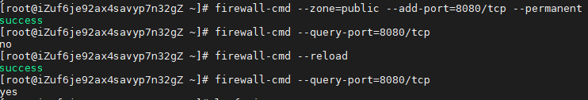

Project management for BOSCH AE-EMM1 department

# <a id="environ">Environment</a>

- **jdk13**
- **mysql5.7**
- **maven3.6.3**

# Build

The maven plugin can be seen in `pom.xml` . Under the root directory, run the command below:

```bash
 mvn clean install
```

# Deploy

This project is running  in **CentOS7** . Related requirements see <a href="#environ">Environment</a> . The `pj_ms-xxx.jar` built by maven has a built-in tomcat server. Just run this command to make it serve:

```shell
nohup java -jar pj_ms-xxx.jar &
```

# FAQ

## How to open a port for my zones in CentOS7 ?



## Scheduled backup for MySQL Database

#### Two steps

1. see [mysql_dump_script.sh]( https://github.com/TransformersWsz/pj_ms/blob/master/mysql_dump_script.sh) which is used for backup db. If this script can't be executed, check it mode and `chmod +x mysql_dump_script.sh` to make it take effect.

2. run `crontab -e` and append a schedule  like below:

   